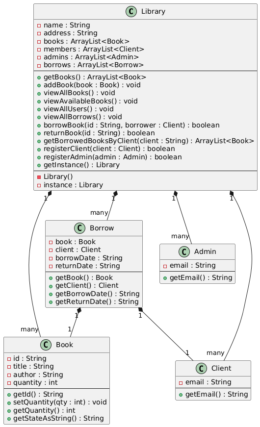
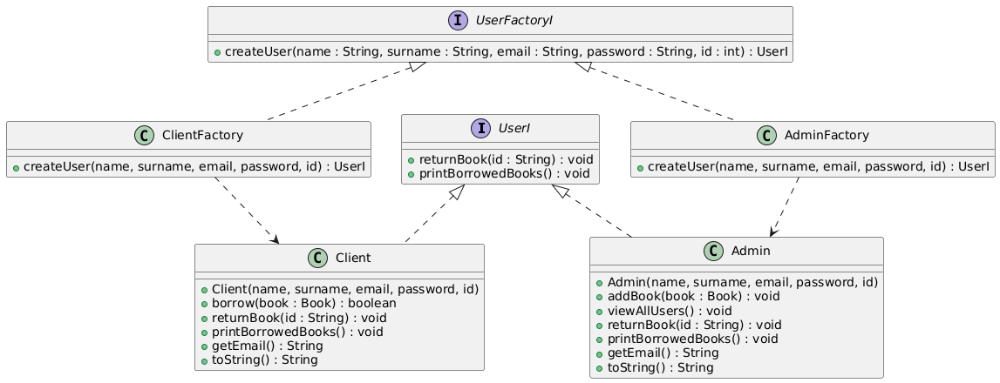
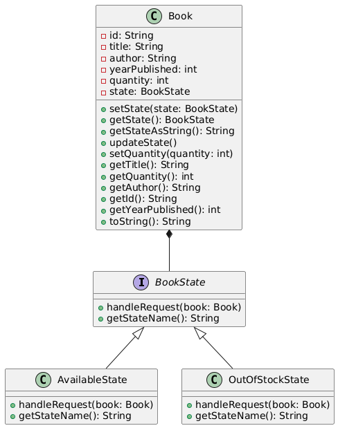
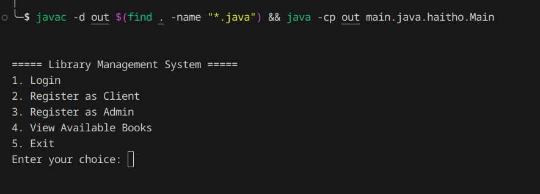
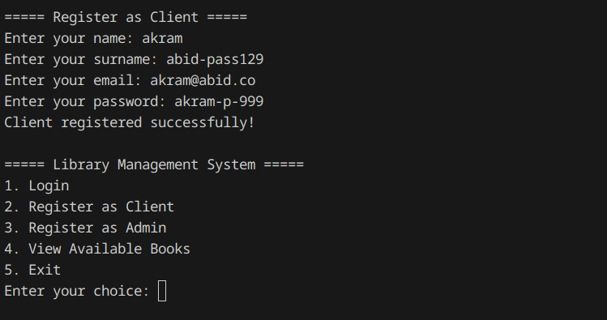
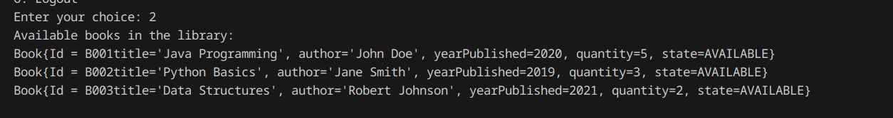
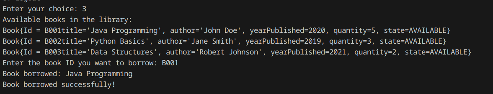
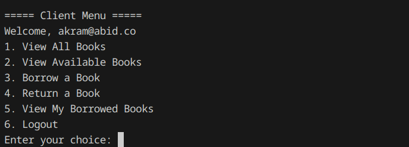
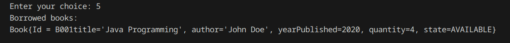

# Library System Design Patterns

This project demonstrates the implementation of various design patterns in a library management system. The primary patterns used include:

- Singleton Pattern
- Factory Method Pattern
- State Pattern

Each of these patterns is applied to solve specific problems, such as managing book states, creating user instances, and ensuring a single instance of the library.

## Singleton Pattern: Library Singleton

The `Library` class implements the Singleton pattern, ensuring that only one instance of the library exists throughout the application.

### Diagram: Library Singleton

## Factory Method Pattern: User Factory

The `UserFactory` interface and its concrete implementations (`ClientFactory` and `AdminFactory`) follow the Factory Method pattern. This allows the creation of different types of users (Client or Admin) without tightly coupling the code to the specific user classes.

### Diagram: User Factory

## State Pattern: Book State

The `BookState` interface and its concrete states (`AvailableState` and `OutOfStockState`) implement the State design pattern. This allows a book to change its state depending on its quantity, moving between available and out-of-stock states.

### Diagram: Book State

## Screenshots of the Application

Below are screenshots showing different sections of the system:

### First Menu

### Register User

### Available Books 

### Borrow Book

### User Dashboard

### User Borrowed Books

